 

## 🧐 About Me

👋 Hi, I'm **Animikh**! I specialize in building and scaling end-to-end Machine Learning Systems.

- 🔭 Currently a **Computer Vision & ML Engineer** at **[Moultrie](https://www.moultrie.com/)**, developing next-gen CV algorithms for wildlife monitoring
- 🎓 **MS in AI** from **Boston University** – research focused on end-to-end **Autonomous Driving** at the **[H2X Lab](https://eshed1.github.io/)**
- 📝 Published at **[IROS '25](https://arxiv.org/abs/2510.08571)** – IEEE/RSJ International Conference on Intelligent Robots and Systems
- 👨‍💻 Previously **CV Engineer & Lead** at **[Wobot.ai](https://wobot.ai/)** – built real-time video analytics from the ground up and scaled it globally
- 🌱 Core interests: **Computer Vision**, **Multi-Modal AI**, and **Software Engineering**
- 🌐 Personal website: **[animikh.me](https://animikh.me)**
- 💬 Always up for a good chat! Find me on [X](https://x.com/animikh_aich) and [LinkedIn](https://www.linkedin.com/in/animikh-aich)

 

---

## 🚀 Professional Impact Highlights

| 💰 Cost Savings | ⚡ Performance | 🎯 Accuracy | 🌍 Scale |
|:-:|:-:|:-:|:-:|
| **$1M+/year** saved via ML pipeline overhaul | **6× faster** inference with NVIDIA Triton | **+16.4% mAP** on Animal Detection | **20,000+ cameras** deployed globally |

---

## 📚 Research & Publications

| Year | Paper | Venue | Role |
|:----:|-------|-------|:----:|
| 2025 | [Scalable Offline Metrics for Autonomous Driving](https://arxiv.org/abs/2510.08571) · [IEEE Xplore](https://ieeexplore.ieee.org/abstract/document/11247722) | **IROS 2025** (IEEE) | First Author |
| 2024 | [Towards Closing the Generalization Gap in Autonomous Driving](https://hdl.handle.net/2144/49890) | MS Thesis, Boston University | First Author |
| 2024 | [Generative AI, Human Creativity, and Art](https://academic.oup.com/pnasnexus/article/3/3/pgae052/7618478) | PNAS Nexus | Acknowledgement |
| 2022 | [LatentGAN Autoencoder: Learning Disentangled Latent Distribution](https://arxiv.org/abs/2204.02010) | arXiv | Co-Author |
| 2019 | [Sentiment Analysis of Restaurant Reviews Using Machine Learning Techniques](https://link.springer.com/chapter/10.1007/978-981-13-5802-9_60) | ICERECT / Springer · 🏆 **Best Paper Award** | Co-Author |
| 2019 | [Encoding Web-based Data for Efficient Storage in ML Applications](https://ieeexplore.ieee.org/abstract/document/9092264) | ICINPRO (IEEE) | First Author |
| 2018 | [Analysis of Customer Opinion Using ML and NLP Techniques](https://papers.ssrn.com/sol3/papers.cfm?abstract_id=3315430) | IJASSR | Co-Author |
| 2018 | [Sales-forecasting of Retail Stores Using ML Techniques](https://ieeexplore.ieee.org/abstract/document/8768765) | CSITSS (IEEE) | Co-Author |

---

## 🛠️ Featured Projects

| Project | Stack | Description |
|---------|-------|-------------|
| 📜 [Site2LLM](https://chromewebstore.google.com/detail/hjhlmhifjbjnmdgboffpofghmhmcikci) | Chrome Extension | Converts any website to neatly structured Markdown in one click |
| 📝 [DigitizeMyNotes](https://digitizemynotes.com/) | LLMs · OCR · RAG | Converts handwritten notes to searchable digital text with AI chat, math recognition & export |
| 🎬 [Video Search](https://videosearch.animikh.me/) | React · Qdrant · VideoPrism | AI-powered semantic video discovery — find videos by describing what you're looking for |
| 🖼️ [Image Search](https://imagesearch.animikh.me/) | React · Qdrant · CLIP | AI-powered semantic image discovery — find visually similar content from natural language descriptions |
| 🎨 [Wallpaper AI](https://wallpaperai.animikh.me/) | Stable Diffusion · GenAI | Generates high-quality 4K wallpapers from text prompts with enhancement |
| 🚗 [Autonomous Driving](https://arxiv.org/abs/2510.08571) | PyTorch · CARLA | End-to-end CIL in a real-world model city · [Video](https://youtu.be/sYv0JlMJbRw) |
| 🌌 [3D Text2LIVE](https://github.com/animikhaich/3D-Text2LIVE) | NeRF · Gen AI | 3D appearance editing of objects via text prompts |
| 🛡️ [Real-Time Face Blur](https://github.com/animikhaich/OpenVINO-Real-Time-Face-Anonymizer) | OpenVINO · Edge AI | CPU-optimized privacy-preserving face anonymization |
| 🏍️ [Helmet Detector](https://github.com/animikhaich/helmetless-rider-detection) | YOLOv3 | Helmetless rider + license plate detection with synthetic data |
| 🏎️ [RL Racer](https://drive.google.com/file/d/1ksSx30KNB6ygsPBKB1XhazZOmrJSKEOs/view) | Double DQN · RL | Racing agent trained on OpenAI Gym CarRacing-v0 |
| 🧠 [Zero-Code Trainer](https://github.com/animikhaich/Zero-Code-Classification-Toolkit) | Docker · Streamlit | No-code model training toolkit (AutoML) |

---

## 📊 GitHub Stats

&nbsp;

 

 

 

---

## 💻 Tech Stack

### 🤖 Machine Learning & AI

### 💻 Languages

### 🌐 Web Development & APIs

### 🗄️ Databases

### ☁️ Cloud & DevOps

### 🛠️ Tools & Environment

---

## 🌍 Community

- 🗓️ **Co-Organizer** — [Boston Computer Vision AIR](https://www.meetup.com/boston-air/) (AI, Autonomy & Robotics) — monthly meetups for 50–90+ participants from academia and industry; past events include AI-Enabled Robotics, Autonomous Vehicles, Navigation Beyond GPS, and more
- 📖 **Manuscript Reviewer** — Manning Publications · Journal of Open Source Software (JOSS) · GTC 2025 · ICCCT 2025 · ICCI 2024

---

## 🔗 Connect With Me

---

  <i>⭐ If you find any of my repositories useful, consider giving them a star!</i>

